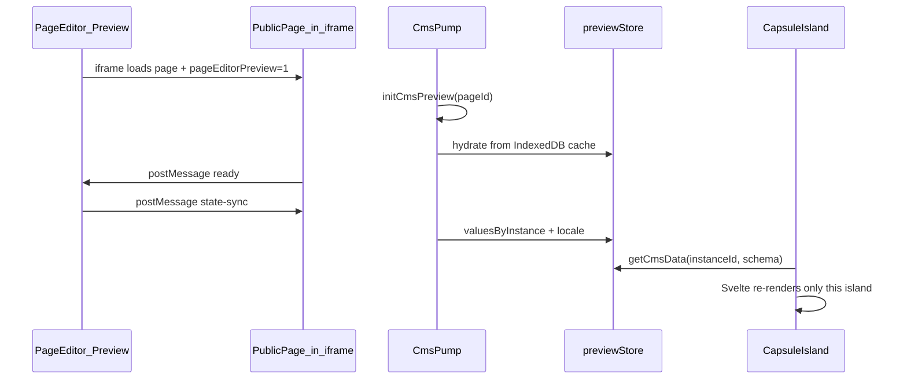

# Live Preview (Page Editor)

This document explains the live preview architecture used by the Page Editor: the goals, how data flows from the sidebar to the preview iframe, and how authors wire Svelte capsules today.

## Goals

- **Single source of truth:** Capsule markup lives in one component (e.g. `TestCapsule.svelte`). There is no separate “preview-only” duplicate.
- **Instant updates:** Editing in the Content Sidebar updates the preview **without** reloading the iframe.
- **Static production build:** The site remains fully static (e.g. GitHub Pages). Preview wiring only runs when the page is opened in editor preview mode (`?pageEditorPreview=1`).
- **Type-safe fields:** Capsules use autogenerated schema types (e.g. `test-capsule.schema.d.ts`) so available fields are known at compile time.
- **No `data-cms-*` attributes:** Live updates use reactive Svelte islands and a shared preview store, not DOM patching on arbitrary HTML nodes.

Inspired by platforms like BaseHub (“Pump”): one invisible client wrapper listens to the editor; capsule UI reads from a shared store.

## High-level flow



1. **Page Editor** ([`Preview.svelte`](../../src/lib/PageEditor/Preview.svelte)) embeds the real public page in an iframe (same origin), with query `pageEditorPreview=1`.
2. On each edit, the editor sends a **`state-sync`** message (`valuesByInstance`, `locale`, `pageId`) via `postMessage`.
3. Inside the iframe, **`CmsPump`** starts the preview runtime and writes into **`previewStore`**.
4. Each **capsule island** (`client:load`) calls **`getCmsData()`**, which reads the store and resolves field values for that `instanceId`.
5. Only the capsule’s Svelte tree updates; the rest of the page is unchanged.

## Why a module store instead of Svelte context?

In Astro, each `client:load` island is a **separate** Svelte app. `setContext` in `CmsPump` does not reach sibling islands (e.g. `TestCapsule` on the page).

So preview state lives in a shared module:

- [`preview-store.svelte.ts`](../../src/lib/cms/preview-store.svelte.ts) — reactive `$state` (`active`, `pageId`, `locale`, `valuesByInstance`)
- Any island that imports this module sees the same data and reactivity.

## Main files

| File | Role |
|------|------|
| [`preview-channel.ts`](../../src/lib/PageEditor/preview-channel.ts) | Message contract: `PAGE_EDITOR_PREVIEW_PARAM`, `state-sync`, `ready` |
| [`cms-preview-runtime.ts`](../../src/lib/cms/cms-preview-runtime.ts) | `postMessage` listener, IndexedDB bootstrap, `ready` to parent |
| [`preview-store.svelte.ts`](../../src/lib/cms/preview-store.svelte.ts) | Shared preview state |
| [`CmsPump.svelte`](../../src/lib/cms/CmsPump.svelte) | Invisible island: starts/stops runtime on preview query + Astro navigations |
| [`get-cms-data.ts`](../../src/lib/cms/get-cms-data.ts) | Capsule API: resolve instance values with schema + locale rules |
| [`Layout.astro`](../../src/layouts/Layout.astro) | Mounts `<CmsPump client:load />` on every page |
| [`Preview.svelte`](../../src/lib/PageEditor/Preview.svelte) | Editor iframe + outbound `state-sync` |

## Production vs preview mode

| | Preview (`?pageEditorPreview=1`) | Normal visit / static build |
|--|----------------------------------|-----------------------------|
| `CmsPump` | Starts runtime, listens to editor | Teardown; `previewStore.active = false` |
| `getCmsData()` | Returns resolved values for `instanceId` | Returns `undefined` |
| Capsule UI | Shows editor draft (empty string in template if you use `?? ""`) | No editor data (until published CMS content is wired separately) |

The preview listener and heavy sync logic only run when the preview query is present. The site build stays **static**; there is no server runtime for CMS.

## Writing a Svelte capsule

### 1. Component (single source of truth)

Example: [`TestCapsule.svelte`](../../src/components/capsules/TestCapsule/TestCapsule.svelte)

```svelte
<script lang="ts">
  import { getCmsData } from "$lib/cms/get-cms-data";
  import { testCapsuleSchema } from "./test-capsule.schema";
  import type { TestCapsuleData } from "./test-capsule.schema.d";

  let { instanceId } = $props();

  const data = $derived(getCmsData<TestCapsuleData>(instanceId, testCapsuleSchema));
</script>

<h2>{data?.title ?? ""}</h2>
```

- Import types from the **autogenerated** `*.schema.d.ts` file.
- Pass the capsule **schema** so `resolveSchemaValues` respects `translatable` and locale.
- Wrap with **`$derived(...)`** so the capsule reacts when the store updates (`getCmsData` is a plain function, not a rune).

### 2. Use on an Astro page

Hydrate the capsule so it can read the store on the client:

```astro
---
import TestCapsule from "$/components/capsules/TestCapsule/TestCapsule.svelte";
---

<TestCapsule instanceId="hero-01" client:load />
```

`instanceId` must match the instance id used in the Page Editor for that block.

### 3. Capsule definition

Point `capsule.definition.ts` at the Svelte component (for registry / auto-detection):

```ts
import TestCapsule from "./TestCapsule.svelte";

export default defineCapsule({
  schema: testCapsuleSchema,
  component: TestCapsule,
  // ...
});
```

## Data resolution rules

`getCmsData` uses [`resolveSchemaValues`](../../src/lib/form-builder/core/translation-runtime.ts):

- Reads `previewStore.valuesByInstance[instanceId]`.
- Resolves each field for `previewStore.locale`, with project `DEFAULT_LOCALE` as fallback per field rules.
- Non-translatable fields always use the default locale bucket.
- If preview is inactive or the instance has no values, returns **`undefined`** (no invented defaults in the resolver).

Display defaults (e.g. `?? ""` in the template) are up to the capsule author.

## IndexedDB bootstrap

When the iframe loads in preview mode, `initCmsPreview` loads the cached document for that `pageId` from IndexedDB (same cache the Content Sidebar writes). That way the first paint can show the last draft before the parent sends `state-sync`.

After the iframe sends **`ready`**, the editor calls `postSyncState()` so the iframe always receives the latest in-memory state.

## What updates in the DOM?

- The **iframe document does not reload** on each keystroke.
- Each **capsule island** re-renders independently when its instance data changes (Svelte diff).
- Other static HTML on the page is untouched.

## Current scope and roadmap

**Implemented today**

- Svelte capsules only (`getCmsData` + `$derived`).
- `CmsPump` in global layout.
- postMessage channel unchanged from the first iframe preview iteration.

**Not in scope yet**

- React / Vue / Preact / Solid adapters (`useCmsData`-style per framework).
- Live preview for **pure `.astro`** markup without a hydrated island.
- Injecting **published** CMS content at static build time (preview is editor-draft only for now).

For pure `.astro` capsules, the intended direction is either a thin `client:load` wrapper around a framework view or a future build-time strategy—not manual `data-cms-*` on every field.

## Manual verification

1. `nvm use 22 && pnpm dev`
2. Open `admin/page-editor/<page-slug>` (e.g. `capsule-prototype`).
3. Edit fields in the Content Sidebar → preview updates without iframe reload.
4. Change preview locale → translatable fields follow the selected locale.
5. Open the public page **without** `pageEditorPreview=1` → capsules render without editor data, no errors.
6. `pnpm build` → static output succeeds.

## Related docs

- [Capsule auto-detection](../capsules/auto-detection-system.md)
- [Schema types autogeneration](../form-builder/schema-types-autogeneration.md)
